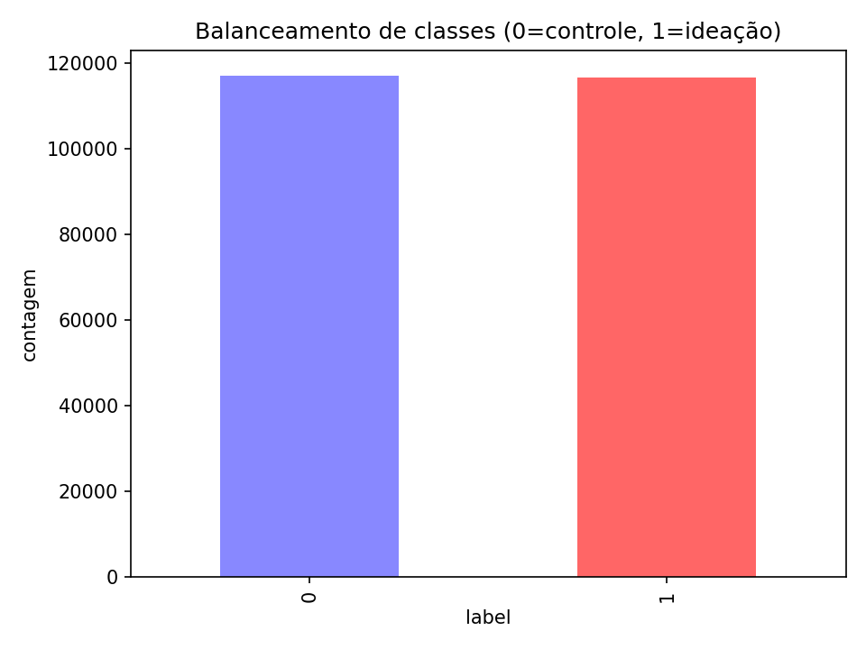
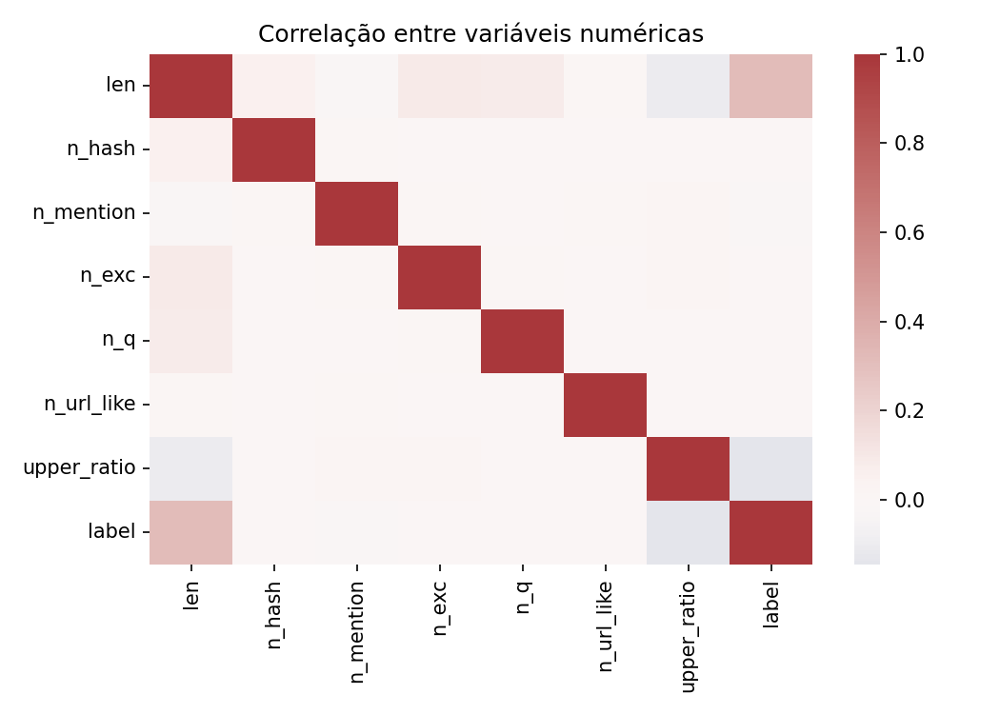
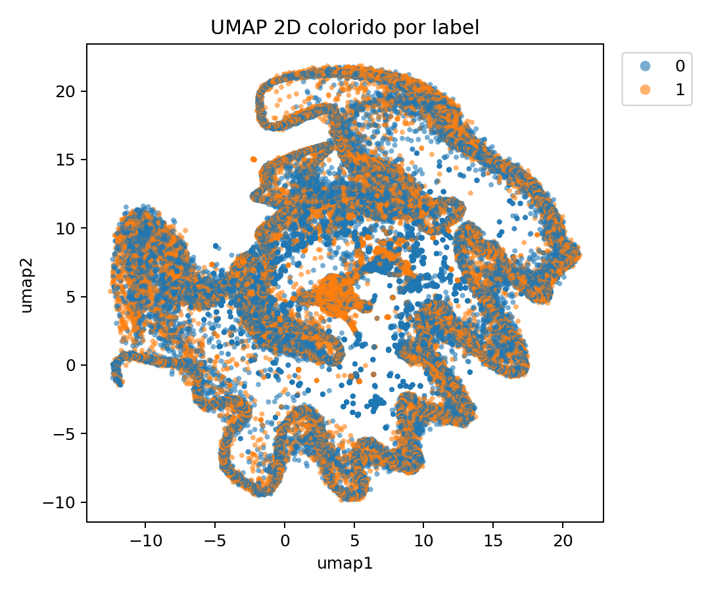
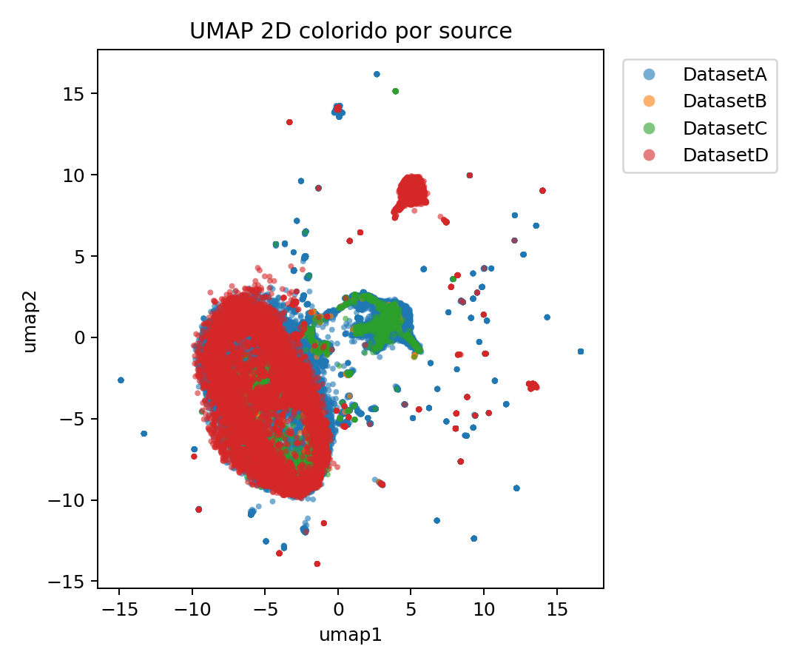

# Análise e Visualização de Textos sobre Ideação Suicida

Este projeto realiza a unificação, limpeza, engenharia de features e visualização de dois datasets públicos contendo textos relacionados à ideação suicida. O objetivo é explorar as características dos textos e visualizar a separação entre as classes (ideação vs. controle) usando técnicas de redução de dimensionalidade como UMAP e t-SNE.

## Resultados Visuais

Abaixo estão alguns dos gráficos gerados pelo pipeline de análise:

| Balanceamento de Classes | Correlação de Features |
| :---: | :---: |
|  |  |

| Projeção UMAP por Rótulo | Projeção UMAP por Fonte do Dataset |
| :---: | :---: |
|  |  |

## Estrutura do Projeto

```
.
├── data/
│   ├── raw/          # ⬅️ Os datasets do Kaggle devem ser colocados aqui
│   └── processed/    # ➡️ Arquivos gerados pelo pipeline
├── notebooks/        # Notebooks para exploração e prototipagem
├── reports/
│   └── figures/      # ➡️ Gráficos e figuras gerados
├── scripts/          # Scripts para executar o pipeline de dados
│   ├── 01_unify_datasets.py
│   ├── 02_build_features.py
│   ├── 03_vectorize_project.py
│   └── 04_make_plots.py
├── src/              # Código fonte reutilizável (funções)
├── .gitignore
├── README.md
└── requirements.txt
```

## 🚀 Setup e Instalação

Siga os passos abaixo para configurar e executar o projeto localmente.

### 1. Clone o Repositório

```bash
git clone https://github.com/danielmeireles1981/Suicide-text-viz.git
cd Suicide-text-viz
```

### 2. Baixe os Datasets

Este projeto não inclui os dados no repositório. Você precisa baixá-los manualmente do Kaggle e colocá-los na pasta `data/raw/`.

1.  **Crie a pasta:**
    ```bash
    mkdir -p data/raw
    ```

2.  **Baixe os seguintes arquivos e salve-os em `data/raw/`:**
    *   **Dataset A:** Suicide and Depression Detection
        *   Nome do arquivo esperado: `Suicide_Detection.csv`
    *   **Dataset B:** Suicide Ideation Detection Dataset
        *   Nome do arquivo esperado: `Suicide_Ideation_Dataset(Twitter-based).csv`

### 3. Crie o Ambiente Virtual e Instale as Dependências

É altamente recomendado usar um ambiente virtual para isolar as dependências do projeto.

```bash
# Crie um ambiente virtual (ex: .venv)
python -m venv .venv

# Ative o ambiente
# No Windows (PowerShell):
.\.venv\Scripts\Activate.ps1
# No macOS/Linux:
# source .venv/bin/activate

# Instale as bibliotecas necessárias
pip install -r requirements.txt
```

## ⚙️ Como Executar o Pipeline

Com o ambiente ativado e os dados no lugar certo, execute os scripts na ordem correta para processar os dados e gerar os resultados.

```bash
# 1. Unifica e limpa os datasets
python scripts/01_unify_datasets.py

# 2. Cria features numéricas a partir do texto
python scripts/02_build_features.py

# 3. Vetoriza os textos e cria as projeções (PCA, UMAP, t-SNE)
python scripts/03_vectorize_project.py

# 4. Gera todos os gráficos e os salva em reports/figures/
python scripts/04_make_plots.py
```

Ao final da execução, a pasta `reports/figures/` conterá todos os gráficos atualizados.